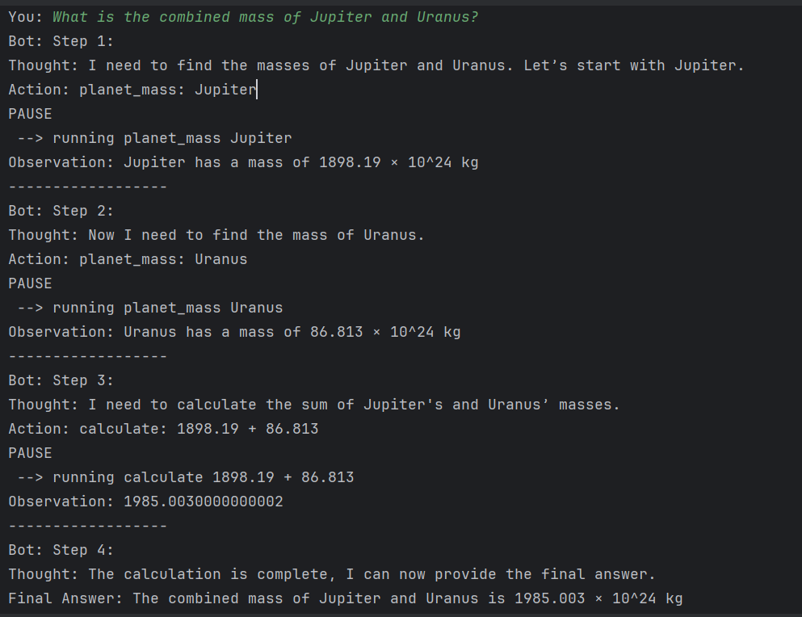

## Logical Agent for Step-by-Step Problem Solving

This repository contains a Python implementation of a logical agent designed to solve problems step-by-step. The agent utilizes a system role and local reasoning capabilities to break down complex tasks into manageable steps, perform calculations, and provide reasoned answers.

## **Example Session:**

---

## **How It Works**

The agent operates in a loop with the following structure:

1. **Thought**: The agent describes its reasoning about the next step.
2. **Action**: The agent executes one action (e.g., `calculate` or `planet_mass`).
3. **PAUSE**: The agent pauses to wait for the observation from the action.
4. **Observation**: The agent processes the result from the action and incorporates it into the next step.
5. **Repeat**: The loop continues until the agent has all the data needed to provide a final answer.

---

## **Code Structure**

- **`Local_Agent.py`**: Contains the `LocalAgent` class, which implements the agent's logic.
- **`system_role.py`**: Defines the `system_role`, which provides the agent with instructions and examples for its operation.
- **Main Script**: The main script (`Logical Agent for Step-by-Step Problem Solving.py` or equivalent) handles user interaction and runs the agent.

---

**Key Features:**

* **Step-by-Step Reasoning:** The agent explicitly outlines its thought process in each step, enhancing transparency and understanding of the problem-solving approach.
* **Action Execution:**  The agent can execute predefined actions such as `calculate` (for numerical operations) and `planet_mass` (to retrieve planetary masses).
* **Interactive Loop:** The agent engages in an interactive loop with the user, iteratively refining its understanding of the problem based on previous steps and user input.
* **Modular Design:**  The code is structured into reusable components like `LocalAgent`, `system_role`, and action handlers for improved maintainability.

---

## **Customization**

- **Add New Actions**: To add new actions, update the `known_actions` dictionary in the code with the new action name and corresponding function.
- **Modify System Role**: Edit the `system_role` to change the agent's instructions or add new examples.

---

**Actions Supported:**

* `calculate`: Performs mathematical calculations (e.g., "calculate: 4 * 7 / 3").
* `planet_mass`: Retrieves the mass of a specified planet from a predefined dictionary.

**Example Usage:**

The included `query_interactive()` function demonstrates how to interact with the agent and observe its step-by-step reasoning process.

---

**Dependencies:**

* Python 3.6 or higher
* `re` (regular expression module)

---

**Future Enhancements:**

* Expand the set of supported actions.
* Implement more sophisticated reasoning capabilities, such as knowledge base integration and logical inference.

---

## **Contact:**

For questions or feedback, please open an issue in the repository or contact the maintainer directly.

